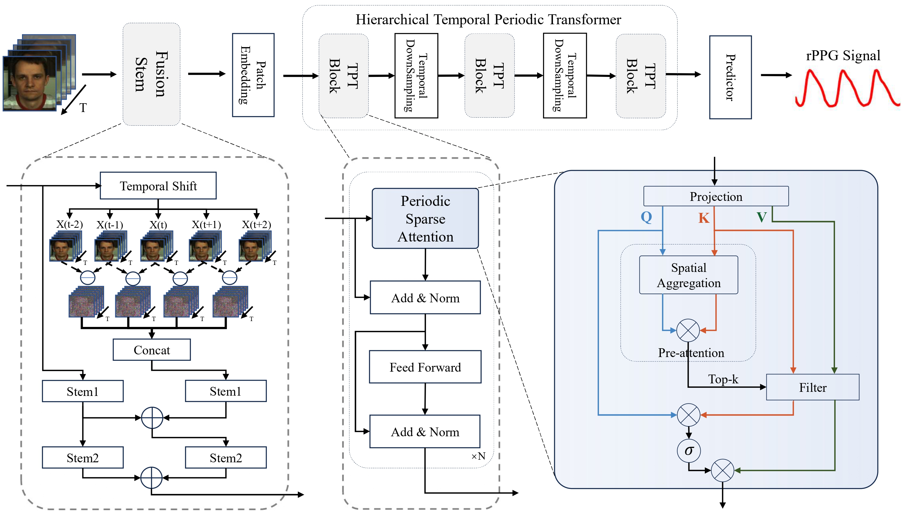

# RhythmFormer
RhythmFormer: Extracting Patterned rPPG Signals based on Periodic Sparse Attention




## :wrench: Setup

STEP 1: `bash setup.sh` 

STEP 2: `conda activate rppg-toolbox` 

STEP 3: `pip install -r ./requirements.txt` 


## :computer: Example of Using Pre-trained Models 

Please use config files under `./configs/infer_configs`

For example, if you want to run The model trained on UBFC-rPPG and tested on MMPD, use `python main.py --config_file ./configs/infer_configs/UBFC-rPPG_MMPD_RHYTHMFORMER.yaml`

## :computer: Examples of Neural Network Training

Please use config files under `./configs/train_configs`

### Intra-dataset on MMPD With RhythmFormer

STEP 1: Download the MMPD raw data by asking the paper authors

STEP 2: Modify `./configs/train_configs/intra/0MMPD_RHYTHMFORMER.yaml` 

STEP 3: Run `python main.py --config_file ./configs/train_configs/intra/0MMPD_RHYTHMFORMER.yaml` 

### Cross-dataset - Training on PURE and testing on UBFC-rPPG With RhythmFormer

STEP 1: Download the PURE raw data by asking the [paper authors](https://www.tu-ilmenau.de/universitaet/fakultaeten/fakultaet-informatik-und-automatisierung/profil/institute-und-fachgebiete/institut-fuer-technische-informatik-und-ingenieurinformatik/fachgebiet-neuroinformatik-und-kognitive-robotik/data-sets-code/pulse-rate-detection-dataset-pure).

STEP 2: Download the UBFC-rPPG raw data via [link](https://sites.google.com/view/ybenezeth/ubfcrppg)

STEP 3: Modify `./configs/train_configs/cross/PURE_UBFC-rPPG_RHYTHMFORMER.yaml` 

STEP 4: Run `python main.py --config_file ./configs/train_configs/cross/PURE_UBFC-rPPG_RHYTHMFORMER.yaml` 


## ✅ Todos

- [ ] Computational Cost: Code

- [x] COHFACE: code + pretrained checkpoints

- [ ] VIPL-HR: code+ pretrained checkpoints

  


## 🎓 Acknowledgement

We would like to express sincere thanks to the authors of [rPPG-Toolbox, Liu *et al.*, 2023](https://proceedings.neurips.cc/paper_files/paper/2023/hash/d7d0d548a6317407e02230f15ce75817-Abstract-Datasets_and_Benchmarks.html), building upon which, we developed this repo. For detailed usage related instructions, please refer the GitHub repo of the [rPPG-Toolbox](https://github.com/ubicomplab/rPPG-Toolbox).

```
@article{liu2024rppg,
  title={rppg-toolbox: Deep remote ppg toolbox},
  author={Liu, Xin and Narayanswamy, Girish and Paruchuri, Akshay and Zhang, Xiaoyu and Tang, Jiankai and Zhang, Yuzhe and Sengupta, Roni and Patel, Shwetak and Wang, Yuntao and McDuff, Daniel},
  journal={Advances in Neural Information Processing Systems},
  volume={36},
  year={2024}
}
```


## 📜 Citation

If you find this repository helpful, please consider citing:

```
@article{zou2024rhythmformer,
  title={RhythmFormer: Extracting Patterned rPPG Signals based on Periodic Sparse Attention},
  author={Zou, Bochao and Guo, Zizheng and Chen, Jiansheng and Zhuo, Junbao and Huang, Weiran and Ma, Huimin},
  journal={arXiv preprint arXiv:2402.12788},
  year={2024}
}
```

